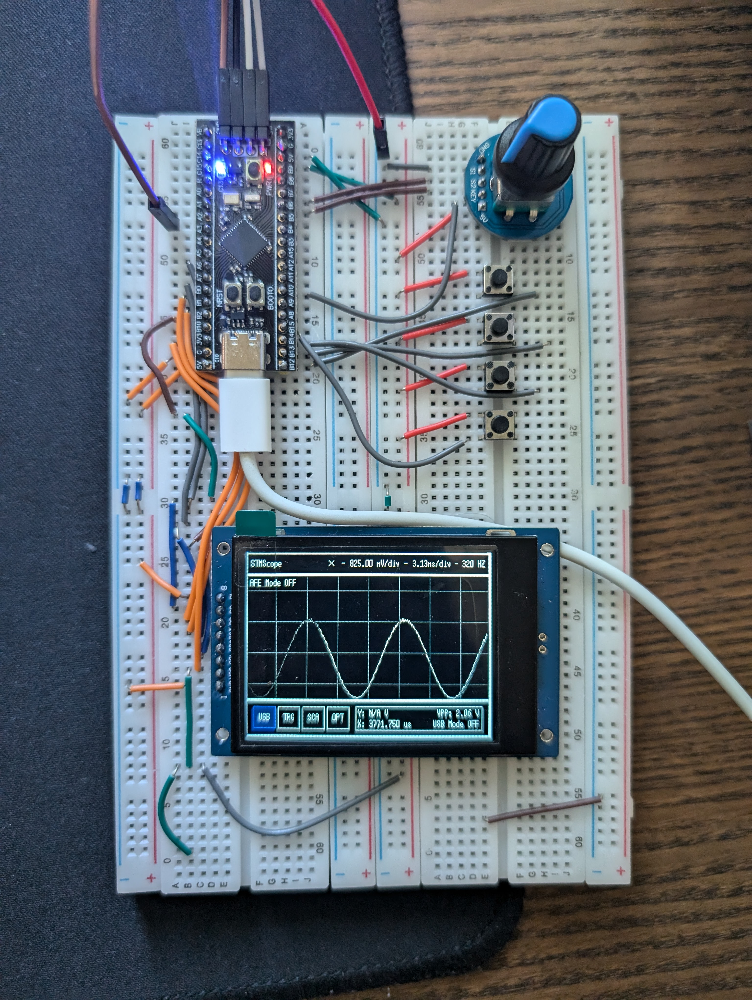
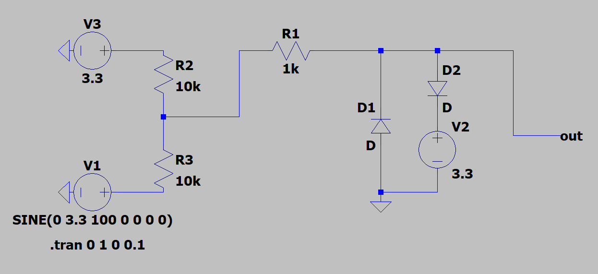
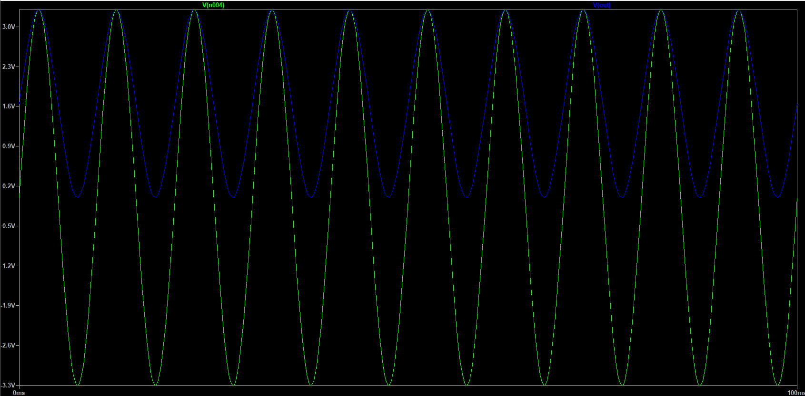
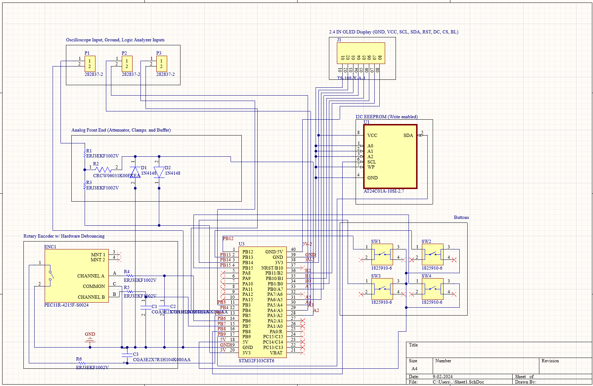
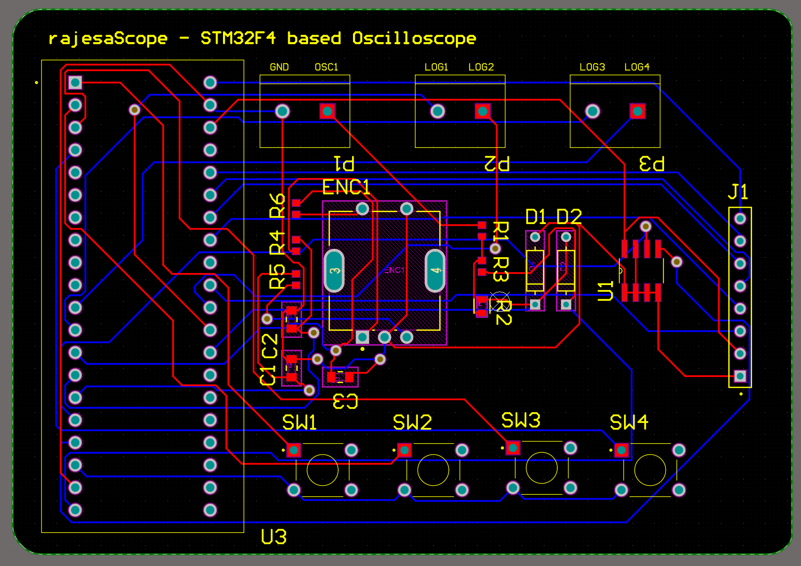

# STMScope

STMScope is a digital oscilloscope based on the STM32F4 microcontroller, designed as a personal project to gain hands-on experience in embedded systems development and to have a product which is suitable for basic lab use.

**Key Features:**

- Measures signals ranging from -3.3V to +3.3V

- Supports frequencies up to 100 kHz

- 312-pixel display for waveform visualization

- Configurable waveform settings

- Measurement tools and cursor functionality

- Adjustable display properties

- Overvoltage protection

- Companion desktop application for PC connectivity via USB CDC

- PCB for more comprehensive form factor

The aim I had for this project was to maximize performance by employing various techniques to create a final product that could be practically used in real-life scenarios. It served as an excellent learning tool, allowing me to deepen my understanding of digital signal processing, optimizing peripherals, communication protocols, and other essential aspects of embedded systems development.

Here is a video link to a short demo: https://youtu.be/zEus6Dh6riI
## Features and Specs

| **Feature**           | **Details**                                                       |
|-----------------------|-------------------------------------------------------------------|
| **Voltage Range**     | -3.3V to 3.3V                                                     |
| **Sampling Rate**     | 320 Hz to 1 MHz                                                   |
| **Input waveform frequency**     | Up to 100Khz                                                |
| **Channels**     | 1                                               |
| **ADC**               | 12-bit ADC configured with timer and DMA                          |
| **USB Mode**          | Transfers data via USB CDC protocol                               |
| **Display Resolution**| 320x260 pixels                                                    |
| **Trigger Modes**     | Rising, Falling, and No Trigger                                   |
| **Scaling (X-axis)**  | 3.13 ms/div to 1 µs/div                                           |
| **Scaling (Y-axis)**  | 0.825 mV/div to 0.05 mV/div                                       |
| **Rolling Mode**      | Supports rolling display of waveform                              |
| **Shifting**          | Supports shifting both X and Y axes                               |
| **Grid**              | Turn on/off grid                                                  |
| **Waveform Colors**   | White, Red, Blue, Yellow, Green                                   |
| **Cursors**           | X and Y cursors                                                   |

## Hardware Used
Microcontroller: STM32F411U6

Display: ST7789 2.4 inch 320x260 pixel SPI TFT Display

Rotator: Generic Rotary Encoder

Buttons: Generic Buttons

## Analog Front End Design

The goal of this design was to create a circuit capable of taking a -3.3V to 3.3V signal and converting it to a 0V to 3.3V range, as the STM32's ADC only functions within this range. The converted value is then transformed back to a -3.3V to 3.3V range in software. Additionally, I aimed to implement overvoltage protection to safeguard the circuit in case of accidental voltage inputs outside the specified range.

**Voltage Attenuation:**

The voltage attenuation was accomplished using a three-resistor network based on the following formula:

Where Vsupply is the voltage provided to the top resistor and Vin is the input voltage. This network maps -3.3V to 0V, while 3.3V remains unchanged. By utilizing this circuit and then adjusting in software using the same formula solving for Vin, I was able to extend the ADC's measurement capability to a higher range of voltages.

Here is the simulation on LTSPice

**Overvoltage Protection:**

Input voltage protection is achieved using two diodes that clamp the voltage ideally at -3.3V and 3.3V. However, considering the average forward voltage drop of these diodes, which is approximately 0.7V, the actual clamping range becomes -4V to 4V.
## PCB Design
To integrate all the components and circuits efficiently, I decided to design a custom PCB. The PCB was created using Altium, which allowed me to precisely layout the circuitry with defined areas where the user should connect their inputs and ouutputs instead of using a breadboard. This design not only helps in compactly housing all the elements but also improves the overall performance and stability of the system.

Schematic

PCB

## Design Considerations

### Nyquist Theorem

One key consideration during the design was adhering to the Nyquist theorem, which states that the sampling rate must be at least twice the input signal frequency to avoid aliasing. Given that the ADC supports a maximum sampling rate of 2.4 MSPS (2.4 MHz), it theoretically can measure signals up to 1.2 MHz without aliasing. 

However, during practical testing, I discovered that to accurately display the waveform without aliasing, the signal had to be oversampled by approximately 10 times the sampling rate. This can be due to various factors, such as reducing the signal to noise ratio. Based on these findings, I opted to allow the user to select a maximum ADC sampling rate of 1 MHz. With this setting, the oscilloscope can accurately measure input waveforms up to 100 kHz. This decision was based on the observation that the ADC’s performance became unstable at higher sampling rates. Through testing, I determined that 1 MSPS struck an optimal balance between accuracy and performance.

### Using Timers

A crucial aspect of the ADC design was implementing a timer to control the ADC sampling rate. Without a timer, the ADC would run at its maximum speed continuously, or if using a polling approach, it would slow down other parts of the oscilloscope while managing the ADC. To address this issue, I used a timer to regulate the ADC's sampling frequency.

By configuring the timer's prescaler and the auto-reload value (ARR), I could precisely set the desired frequency rate for the timer. The frequency is determined using the following formula:

This formula calculates the frequency of one timer tick. To determine the time required for one complete waveform measurement, I multiplied this frequency by the number of data points (312) and then took the reciprocal to find the total measurement time.

This method allows precise control over the ADC sampling rate, ensuring that the oscilloscope can capture waveforms accurately without compromising the performance of other system components.

### Using DMA

Another critical aspect of the design was integrating the timer-based ADC with Direct Memory Access (DMA). Typically, the CPU would handle the task of transferring data from the ADC to a buffer for further processing before displaying the waveform. However, with the ADC operating at speeds up to 1 MHz, relying on the CPU for this data transfer could significantly slow down processing and affect overall measurement performance.

To address this, I implemented DMA in Peripheral-to-Memory mode with circular mode turned off, connected directly to the ADC. In this configuration, DMA automatically transfers data from the ADC to memory with each ADC tick, until all 312 data points have been collected. This setup allows DMA to handle data transfer independently of the CPU, freeing up the CPU to perform other tasks, such as updating and displaying the waveform in the background. Once a whole buffer has been transferred and complete, the ADC will trigger a completion interrupt where I determine if the waveform adheres to the selected trigger options, then pass it on to be processed and displayed.

This DMA integration greatly enhanced system performance by ensuring that data collection and processing could occur simultaneously without imposing a significant load on the CPU.

### Interrupts for buttons

For the input buttons, I opted for an interrupt-based approach instead of polling to enhance efficiency and responsiveness. This choice minimizes CPU usage, which is crucial given the frequent display updates and numerous operations performed on the waveform, allowing the CPU to focus on these tasks without being bogged down by constant button state checks.

### Communication Protocols to PC

To transfer data to the PC, I chose to use USB CDC instead of UART, I2C, or SPI. USB CDC provides a straightforward user experience, allowing the STMScope to connect to the PC via a simple USB-C to USB-C cable. This is significantly easier than UART or I2C, which require identifying specific communication pins and using adapters to connect to the PC. Additionally, USB CDC offers a fast communication speed on the STM32F4, with a typical rate of 12 Mbps (Full Speed USB). This is generally faster than UART or I2C for PC communication, though not as fast as the 480 Mbps of High Speed USB, which would require additional hardware or a specific STM32F4 variant with High Speed USB support.

### Analog Front End (AFE) mode

When AFE Mode is enabled, the STM32 oscilloscope can handle input voltages ranging from -3.3V to 3.3V. This mode effectively doubles the input voltage range that the ADC needs to cover. However, because the ADC's resolution remains at 12 bits (0 to 4095), this extended range reduces the accuracy of measurements. Specifically, the ADC has to span the entire -3.3V to 3.3V range with the same 12-bit resolution, which effectively halves the resolution in each half of the range.

Therefore, if you are working with input voltages between 0V and 3.3V, it is advisable to disable AFE Mode. This setting will maintain the ADC's full 12-bit resolution and ensure optimal accuracy for measurements within this range.

## How to use
- Download the project repository and open it with STM32CubeIDE.
- Compile and upload the code to your STM32F411 board.
- Connect the oscilloscope probe to the appropriate input on your board.

### Navigation and Controls

- Use the rotary encoder to navigate between menus. 
- Press down on the rotary encoder to select a menu item.

### Button Functions

- **Button 1**: Return to the previous menu
- **Button 2**: Start or stop measurements
- **Button 3**: Reset X/Y scaling and shifting
- **Button 4**: Toggle the Analog Front End mode on or off

### Additional Features

- Rotate the encoder to adjust settings within menus (e.g., timebase, voltage scale)
- Use the touchscreen (if available) for direct interaction with the oscilloscope interface

### Suggestion

- While the STMScope works without a reference voltage and ground, to ensure maximum performance connect the ground pin on the STM32 with a ground source from your input. Then connect 3.3V to the STM32 3V3 pin.
## Libraries Used
- ST7789-STM32-uGUI: https://github.com/deividAlfa/ST7789-STM32-uGUI
- HAL
- Pyserial
- Matplotlib
- NumPy
- Tkinter